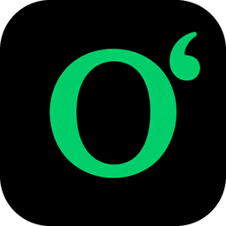

#  UzTypist


**Oʻzbek lotin yozuvidagi maxsus belgilarni (`ʻ`, `ʼ`, `“ ”`, `– —`) kontekstga qarab avtomatik toʻgʻrilaydigan Windows dasturi.**

Klaviaturada `Oʻ`, `Gʻ`, tutuq belgisi (`ʼ`) va qoʻshtirnoqlar (`“ ”`) uchun alohida tugma yoʻq. Koʻpchilik ular oʻrniga oddiy `'` va `"` bosadi — natijada matn Unicode jihatidan notoʻgʻri boʻladi. UzTypist fonda ishlaydi: siz tugmani bosgan zahoti kursor oldidagi matnni oʻqiydi va bosilgan tugmani tegishli toʻgʻri Unicode belgisiga almashtiradi.

> [!NOTE]
> Dasturning oynasi yoʻq — u tizim tagida (tray) ishlaydi va **brauzer, MS Word, Telegram, Notepad** — qayerda yozishingizdan qatʼi nazar, butun tizim boʻylab amal qiladi.

---

## 🚀 Oʻrnatish

1. [**Releases**](https://github.com/abdurasilov/uz-typist/releases/latest) sahifasidan eng oxirgi `UzTypist-*.exe` faylini yuklab oling.
2. Faylni ishga tushiring.
3. Tayyor — dastur ikonkasi tizim tagida (soat yonida) paydo boʻladi.

> [!TIP]
> Alohida oʻrnatish jarayoni ham, .NET Runtime ham talab qilinmaydi — dastur bitta koʻchma `.exe` faylidan iborat. Windows bilan avtomatik ishga tushirish **birinchi ishga tushishda yoqilgan** boʻladi; uni tray menyusidan istalgan vaqtda oʻchirishingiz mumkin.

---

## 🔤 Almashtirish qoidalari

Odatdagidek yozavering — UzTypist kerakli belgilarni oʻzi toʻgʻrilaydi.

### 1. Tutuq belgisi, `Oʻ` va `Gʻ` — `'` tugmasi

Har safar `'` bosilganda quyidagicha almashtiriladi:

| Qachon (kontekst) | Chiqadigan belgi | Unicode | Misol |
|:---|:---:|:---:|:---|
| `O`, `o`, `G`, `g` harfidan keyin | **`ʻ`** | `U+02BB` | `O'zbek` → **`Oʻzbek`**, `g'isht` → **`gʻisht`** |
| boshqa har qanday holatda | **`ʼ`** | `U+02BC` | `ma'no` → **`maʼno`**, `san'at` → **`sanʼat`** |

*Bosh/kichik harf `Shift` va `Caps Lock` holatiga qarab avtomatik aniqlanadi.*

### 2. Qoʻshtirnoqlar — `Shift + '` (yaʼni `"`)

Har safar `"` bosilganda quyidagicha almashtiriladi:

| Qachon (kontekst) | Chiqadigan belgi | Unicode | Misol |
|:---|:---:|:---:|:---|
| soʻz/gap boshida (boʻshliq, qavs yoki matn boshida) | **`“`** (ochuvchi) | `U+201C` | `"salom` → **`“salom`** |
| soʻz ichida yoki oxirida | **`”`** (yopuvchi) | `U+201D` | `salom"` → **`salom”`** |
| ochilgan qoʻshtirnoq ichida yana `"` bosilsa | **`‘ … ’`** (ichki tirnoq) | `U+2018` / `U+2019` | `"u "keldi" dedi"` → **`“u ‘keldi’ dedi”`** |

### 3. Tirelar — `-` tugmasi

Bu qoida ketma-ket **tez** bosishlarga (taxminan 0,4 soniya ichida) asoslanadi. Orada pauza boʻlsa, hisob yangidan boshlanadi.

| Bosasiz | Natija | Unicode | Nomi | Izoh |
|:---|:---:|:---:|:---|:---|
| `-` bir marta | **`-`** | `U+002D` | Oddiy defis | oʻzgarmaydi |
| `-` tez 2 marta | **`—`** | `U+2014` | Uzun tire (em dash) | gap ichida fikrni ajratish |
| `-` tez 3 marta | **`–`** | `U+2013` | Qisqa tire (en dash) | har qanday holatda qisqa tire kerak boʻlsa |

> [!TIP]
> Qoʻshimcha qulaylik: agar tire oldida **raqam** turgan boʻlsa, 2 marta bosishning oʻzidayoq qisqa tire (`–`) chiqadi — raqamli oraliqlarda odatda shu ishlatiladi. Masalan: `5--` → **5–10**, `1991--` → **1991–2026**.

---

## 🖱️ Tizim tagidagi (tray) menyu

Tizim tagidagi dastur ikonkasini **oʻng tugma** bilan bosing:

| Menyu elementi | Vazifasi |
|:---|:---|
| **UzTypist faol / pauzada** | Holat koʻrsatkichi (bosilmaydi). Pauzada boʻlsa yozuvni oʻzgartirmaydi. |
| **Pauza** | Almashtirishni vaqtincha toʻxtatadi. Yana bosilsa qayta ishga tushadi. |
| **Avtomatik ishga tushirish** | Windows yuklanganda dasturni avtomatik ishga tushirishni yoqadi/oʻchiradi. |
| **Chiqish** | Dasturni toʻliq yopadi. |

---

## 💡 Foydali eslatmalar

* `'` va `"` tugmalari **har doim** maxsus belgiga almashtiriladi. Agar sizga toza (straight) `'` yoki `"` kerak boʻlsa, avval **Pauza**ni yoqing.
* Almashtirish faqat siz tugmani bosgan paytda amalga oshadi — u mavjud matnni orqaga qaytib tahrirlamaydi.
* Sichqoncha bilan boshqa joyni bosganingizda yoki boshqa oynaga oʻtganingizda kontekst tozalanadi, shu tufayli notoʻgʻri almashtirish kamayadi.

---

## 🛠️ Dasturchilar uchun (Build & Run)

Loyihani mustaqil yigʻish uchun **.NET 10 SDK** oʻrnatilgan boʻlishi kerak.

Debug rejimida ishga tushirish:

```powershell
dotnet run
```

Tarqatish uchun yagona `.exe` yaratish (single-file publish):

```powershell
dotnet publish -c Release
```

Tayyor `.exe` fayli quyidagi manzilda hosil boʻladi:
`bin\Release\net10.0-windows\win-x64\publish\UzTypist.exe`

---

## ⚙️ Texnik tavsif

* **C# / .NET 10** (`net10.0-windows`) asosida yozilgan.
* **UI Automation** — `TextPattern` orqali kursor oldidagi haqiqiy belgini oʻqiydi.
* **Zaxira usul (fallback)** — UI Automation qoʻllab-quvvatlanmagan ilovalarda oxirgi bosilgan tugmalar tarixi asosida kontekstni aniqlaydi.
* **Win32 hook** (`WH_KEYBOARD_LL`) — tugma bosilishini tizim darajasida tutib oladi va `SendInput` orqali almashtiradi.
* **Rekursiya himoyasi** — dastur oʻzi yuborgan belgilarga `dwExtraInfo` tegi qoʻyiladi, bu esa cheksiz aylanishning oldini oladi.
* **Sichqoncha va oyna kuzatuvi** — bosish yoki oyna almashishida kontekst bufer tozalanadi.
* **Yagona nusxa (single instance)** — Mutex orqali bir vaqtda faqat bitta nusxa ishlaydi.

---

## 📁 Loyiha tuzilishi

<details>
<summary>Fayl va papkalar tuzilishini koʻrsatish</summary>

```
UzTypist/
├── UzTypist.csproj                       # Loyiha konfiguratsiyasi (.NET 10, single-file publish)
├── README.md                             # Loyiha hujjati
└── src/                                  # Barcha manba kodi
    ├── Program.cs                        # Kirish nuqtasi: Mutex va ApplicationContext
    ├── Tray/
    │   └── TrayAppContext.cs             # Tray ikonka, menyu va avtostart (Registry)
    ├── Hooks/                            # Win32 tizim hook'lari
    │   ├── KeyboardHook.cs               # Klaviatura hook, kontekst tahlili va SendInput
    │   ├── MouseClickWatcher.cs          # Sichqoncha bosilganda kontekstni tozalash
    │   └── ForegroundWindowWatcher.cs    # Oyna almashganda kontekstni tozalash
    └── Context/
        └── CaretContextReader.cs         # UI Automation: kursor oldidagi matnni oʻqish
```

</details>

---

## 📄 Litsenziya

Ushbu dasturiy taʼminotdan [MIT](LICENSE) litsenziyasi boʻyicha erkin foydalanishingiz mumkin.
